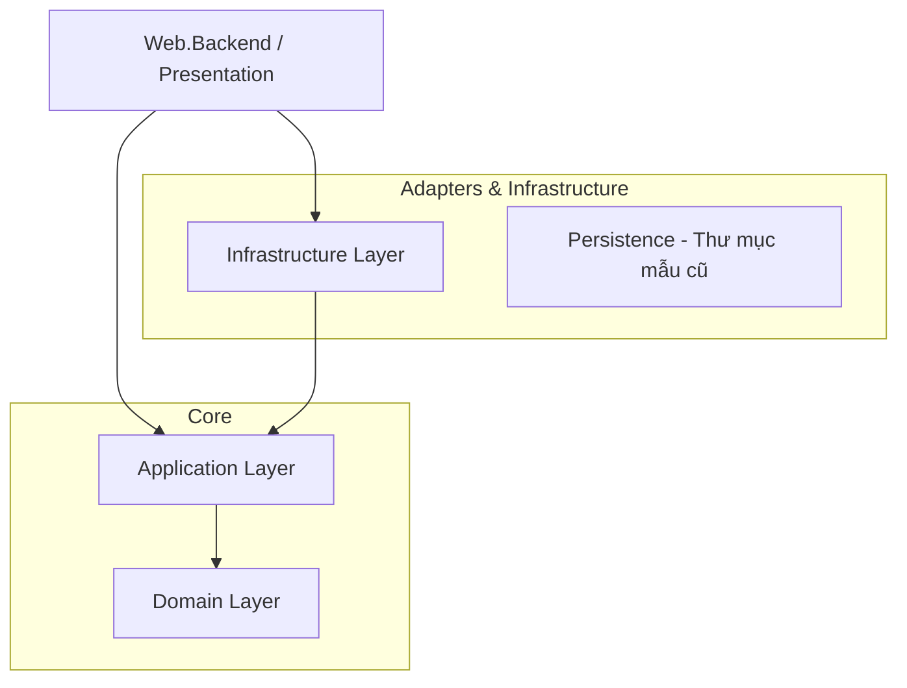

# Báo cáo Phân tích Kiến trúc & Dự án: Project LUC (Hệ thống Quản lý Khách hàng)

Tài liệu này cung cấp cái nhìn toàn diện về cấu trúc, kiến trúc và luồng dữ liệu của dự án nhằm giúp nhà phát triển nhanh chóng làm quen, triển khai và tùy biến hệ thống một cách hiệu quả.

---

## 1. Nghiệp vụ dự án: Dự án này viết về cái gì?
**Project LUC** là một hệ thống quản lý khách hàng thân thiết (**Customer Management & Loyalty System**), đặt bàn nhà hàng (**Restaurant Booking**), quản lý thực đơn, đặt món (**Ordering**), hóa đơn (**Invoicing**), tích hợp cổng thanh toán (**VnPay**), thông báo đẩy (**Firebase**), xác thực qua tin nhắn (**eSMS**) và hệ thống ưu đãi/tích điểm thành viên (điểm thưởng, hạng thành viên, voucher).

Hệ thống xử lý cả các luồng hoạt động quản trị viên (dành cho admin) lẫn các luồng giao dịch trực tiếp từ khách hàng (đặt bàn, đổi voucher, tương tác thành viên).

---

## 2. Công nghệ đang sử dụng trong dự án
Ứng dụng được xây dựng trên nền tảng công nghệ Microsoft .NET hiện đại, có tính phân tách cao:

* **Backend (BE)**:
  * **Framework**: ASP.NET Core MVC & Web API (Phiên bản `.NET 7.0`).
  * **Design Patterns**: CQRS (Command Query Responsibility Segregation) triển khai qua thư viện **MediatR**.
  * **Database ORM**: **Entity Framework Core 7** (sử dụng provider PostgreSQL) và **Dapper** (để thực hiện các truy vấn SQL nhanh/tùy biến ở tầng repository).
  * **Task Scheduling**: **Quartz.NET** để lập lịch các tác vụ chạy nền và xử lý Outbox events.
  * **Luồng sự kiện**: **Outbox Pattern** để truyền phát bất đồng bộ các sự kiện domain event nhằm tránh lỗi mất mát giao dịch (transaction).
* **Frontend (FE)**:
  * **UI Engine**: Razor Views (`.cshtml`) được render phía máy chủ (Server-side rendering).
  * **Styling**: **Tailwind CSS v3** kết hợp thư viện thành phần giao diện **Flowbite UI**.
  * **Scripting**: **jQuery** và Javascript hiện đại.
* **Cơ sở dữ liệu (DB)**:
  * **PostgreSQL** với quy chuẩn đặt tên dạng snake-case (ví dụ: `member_activities`).
* **Các tích hợp bên ngoài (External Integrations)**:
  * **Quản lý danh tính & Ủy quyền**: **Keycloak** (để đăng nhập một lần - SSO, quản lý client secrets và kiểm tra token).
  * **Lưu trữ tệp/hình ảnh**: **AWS S3** (sử dụng gói thư viện AWSSDK.S3).
  * **Cổng SMS**: **eSMS** (sử dụng để gửi mã OTP, kiểm tra hợp lệ của số điện thoại).
  * **Thông báo đẩy (Push Notifications)**: **Firebase Cloud Messaging (FCM)**.
  * **Cổng thanh toán**: **VnPay**.
  * **Email**: **SendGrid** API.

---

## 3. Kiến trúc dự án (Clean Architecture)
Mã nguồn tuân thủ nghiêm ngặt mô hình **Clean Architecture** (Kiến trúc củ hành - Onion Architecture), đảm bảo các quy tắc nghiệp vụ cốt lõi không bị phụ thuộc vào cơ sở dữ liệu, framework giao diện hay các dịch vụ tích hợp bên ngoài.



### Chi tiết các tầng kiến trúc:

1. **Domain Layer (Tầng nghiệp vụ cốt lõi - `Domain/`)**
   * **Nhiệm vụ**: Chứa các mô hình thực thể nghiệp vụ cốt lõi (Entities), Aggregate Roots, Domain Events và các giao diện Repository interfaces.
   * **Phụ thuộc**: Hoàn toàn độc lập, không tham chiếu đến bất kỳ thư viện ngoài nào (C# thuần túy).
   * **Thành phần chính**: Các thư mục đại diện cho các nhóm nghiệp vụ (ví dụ: `Bookings`, `Members`, `Orders`, `Vouchers`). Mỗi thư mục chứa các lớp thực thể, các sự kiện nghiệp vụ và các Value Objects.

2. **Application Layer (Tầng ứng dụng - `Application/`)**
   * **Nhiệm vụ**: Chứa các ca sử dụng (Use Cases), Commands, Queries, Validators và các bộ xử lý MediatR handlers tương ứng.
   * **Phụ thuộc**: Chỉ tham chiếu duy nhất tới **Domain Layer**.
   * **Thành phần chính**: Được tổ chức theo lát cắt dọc (vertical slice) theo nghiệp vụ (ví dụ: `Members`, `Orders`). Mỗi thư mục chứa các hành động cụ thể bao gồm:
     * `*Command.cs` / `*Query.cs` (Bản ghi truyền dữ liệu - C# record).
     * `*CommandHandler.cs` / `*QueryHandler.cs` (Logic thực thi nghiệp vụ).
     * `*CommandValidator.cs` (Cấu hình kiểm tra dữ liệu đầu vào sử dụng FluentValidation).

3. **Infrastructure Layer (Tầng hạ tầng - `Infrastructure/`)**
   * **Nhiệm vụ**: Triển khai cụ thể các giao diện trừu tượng từ tầng ứng dụng, quản lý kết nối cơ sở dữ liệu và các Adapter tích hợp dịch vụ ngoài.
   * **Phụ thuộc**: Tham chiếu đến cả hai tầng **Application** và **Domain**.
   * **Thành phần chính**:
     * `Repositories/`: Triển khai các giao diện repository của tầng Domain (sử dụng EF Core & Dapper).
     * `Data/`: Quản lý các nhà máy kết nối cơ sở dữ liệu (`SqlConnectionFactory`) và `ApplicationDbContext`.
     * `Authentication/`: Tích hợp các bộ xử lý xác thực Keycloak.
     * `Jobs/`: Định nghĩa các tác vụ chạy nền định kỳ (như `DailyJob`, bộ quét Outbox).

4. **Web.Backend Layer (Tầng hiển thị/API - `Web.Backend/`)**
   * **Nhiệm vụ**: Điểm khởi chạy của ứng dụng, cấu hình định tuyến, đường ống HTTP (middleware pipeline), điều hướng controller và các trang giao diện.
   * **Phụ thuộc**: Tham chiếu tới **Infrastructure** (để khởi tạo các dịch vụ) và **Application** (để gửi các lệnh qua MediatR).
   * **Thành phần chính**:
     * `Controllers/`: Điều hướng các yêu cầu HTTP và chuyển đổi chúng thành các MediatR commands/queries.
     * `Views/`: Các tệp CSHTML chứa mã hiển thị giao diện sử dụng Tailwind/Flowbite.
     * `wwwroot/`: Chứa các tệp tĩnh và stylesheet Tailwind CSS sau khi build.

> [!NOTE]
> **Lưu ý về thư mục dư thừa**: Dự án có thư mục `Persistence` ở ngoài cùng chứa tệp `.csproj` và một số file migration/repository cũ. Thư mục này **không** được liên kết trong giải pháp Visual Studio chính (`LUC.sln`) và không được tham chiếu bởi `Web.Backend`. Tất cả logic tương tác DB thực tế hiện tại đều nằm trong dự án `Infrastructure`. Bạn có thể bỏ qua thư mục `Persistence` này vì đây là phần mã nguồn mẫu cũ còn sót lại.

---

## 4. Đánh giá chất lượng Code

### Điểm mạnh kiến trúc:
* **Tính độc lập cao**: Quy tắc nghiệp vụ (Application/Domain) hoàn toàn tách biệt khỏi các thư viện ngoài. Nếu cần đổi từ PostgreSQL sang SQL Server hoặc đổi nhà cung cấp cổng SMS, bạn chỉ cần sửa ở tầng Infrastructure mà không cần đổi logic cốt lõi.
* **Cấu trúc CQRS rõ ràng**: Các lệnh ghi (Command) và đọc (Query) được phân tách thành từng lát cắt dọc (vertical slice) tự đóng gói, giúp định vị lỗi và viết unit test cực kỳ dễ dàng.
* **Sử dụng Pipeline Behaviors**: Các tác vụ bổ trợ như kiểm tra tính hợp lệ dữ liệu (FluentValidation) hay ghi nhật ký hệ thống (Logging) được tách biệt thành các middleware của MediatR (`ValidationBehavior`, `LoggingBehavior`), giữ cho các bộ xử lý handler chính rất ngắn gọn và sạch sẽ.
* **Cơ chế Outbox cho Domain Events**: Các sự kiện nghiệp vụ phát sinh (ví dụ: cộng điểm khi đặt bàn thành công) được lưu trữ vào bảng `OutboxMessages` cùng trong giao dịch (transaction) thay đổi trạng thái chính, sau đó được quét xử lý bất đồng bộ qua Quartz. Điều này giúp hệ thống hoạt động ổn định, tránh việc một lỗi gửi mail hay thông báo làm hỏng luồng thanh toán chính.

### Điểm cần cải thiện (Nợ kỹ thuật):
* **Trùng lặp mã nguồn mẫu**: Việc tồn tại thư mục `Persistence` gây hiểu lầm cho người mới bắt đầu tiếp cận dự án.
* **Phình to Controller**: Một số Controllers xử lý thủ công quá nhiều logic ánh xạ redirect hoặc trùng lặp các thuộc tính Route.
* **File cấu hình trống**: `appsettings.json` trong kho lưu trữ hoàn toàn trống, đòi hỏi người cài đặt lần đầu phải tự cấu hình thủ công đầy đủ các tham số kết nối PostgreSQL, Keycloak, AWS S3, VnPay, v.v.

---

## 5. Luồng dữ liệu của hệ thống (System Data Flow)

Sơ đồ tuần tự dưới đây thể hiện cách một yêu cầu đăng ký thành viên đi qua các tầng Clean Architecture:

```mermaid
sequenceDiagram
    autonumber
    actor User as Client Browser
    participant Controller as MemberController (Web.Backend)
    participant MediatR as MediatR Handler Pipeline
    participant Validator as RegisterMemberCommandValidator
    participant Handler as RegisterMemberCommandHandler
    participant Repository as MemberRepository (Infrastructure)
    participant DbContext as ApplicationDbContext (Infrastructure)
    database Db as PostgreSQL Database
    participant Job as ProcessOutboxMessagesJob (Quartz)

    User->>Controller: POST /Member/Create (Dữ liệu Form)
    Controller->>Controller: Ánh xạ sang RegisterMemberCommand
    Controller->>MediatR: Send(Command)
    MediatR->>Validator: Chặn & kiểm tra tính hợp lệ dữ liệu
    alt Validation bị lỗi (Không hợp lệ)
        Validator-->>MediatR: Ném ra ValidationException
        MediatR-->>Controller: Trả về lỗi validation
        Controller-->>User: Hiển thị cảnh báo trên giao diện
    else Validation thành công
        MediatR->>Handler: Gọi bộ xử lý Handle(Command)
        Handler->>Repository: Kiểm tra số điện thoại/email đã tồn tại chưa
        Repository->>Db: Truy vấn DB
        Db-->>Repository: Kết quả
        Handler->>Repository: Thêm đối tượng thành viên mới (New Member Entity)
        Note over Handler,Repository: Thực thể Member kích hoạt sự kiện MemberRegisteredDomainEvent
        Handler->>DbContext: Lưu thay đổi SaveChangesAsync()
        DbContext->>DbContext: Chụp Domain Event -> Chuyển thành OutboxMessage
        DbContext->>Db: Commit Transaction (Lưu Member + OutboxMessage đồng thời)
        Db-->>DbContext: Lưu thành công
        Handler-->>MediatR: Trả về Guid (ID của thành viên mới)
        MediatR-->>Controller: Trả về Guid
        Controller-->>User: Chuyển hướng đến trang Đăng nhập / Thành công
    end

    loop Mỗi 10 giây
        Job->>Db: Đọc các Outbox Messages chưa xử lý
        Db-->>Job: Danh sách tin nhắn Outbox
        Job->>MediatR: Phát sự kiện Publish(DomainEvent)
        Note over MediatR: Gọi WelcomeEmailHandler để gửi thư chào mừng
        Job->>Db: Đánh dấu các tin nhắn Outbox đã xử lý xong
    end
```

---

## 6. Hướng dẫn sử dụng GitNexus và Understand-Anything để đọc hiểu dự án

Để tối ưu hóa quá trình làm quen và tùy biến dự án, bạn nên kết hợp cả hai công cụ theo cách sau:

### Sử dụng GitNexus (Tìm kiếm ngữ nghĩa & Phân tích tác động)
GitNexus đóng vai trò là **người dẫn đường mã nguồn** và **bảo vệ an toàn code**.

* **Để tìm hiểu luồng của một tính năng cụ thể**:
  Chạy lệnh tìm kiếm như `query({query: "BookingReservation"})` hoặc `query({query: "Voucher Redeem"})`. GitNexus sẽ trả về chuỗi các cuộc gọi (processes) ánh xạ từ Controllers qua Handlers tới các Repositories tương ứng.
* **Để phân tích tác động trước khi thay đổi (Blast Radius Analysis)**:
  Trước khi sửa đổi hoặc xóa một hàm/lớp quan trọng, hãy chạy phân tích tác động:
  `impact({target: "MemberRepository", direction: "upstream"})`
  Lệnh này giúp hiển thị các controllers hoặc handlers đang gọi và phụ thuộc vào class đó để tránh gây lỗi nghiêm trọng (regression bug).
* **Để kiểm tra lại các thay đổi trước khi commit**:
  Chạy `detect_changes({scope: "all"})` để xem các dòng code thay đổi ảnh hưởng cụ thể tới các luồng hoạt động nào của hệ thống.

### Sử dụng Understand-Anything (Biểu đồ trực quan & Tổng quan kiến trúc)
Understand-Anything đóng vai trò là **kiến trúc sư trực quan**.

* **Để xem toàn bộ dự án dưới dạng biểu đồ cấu trúc**:
  Khởi động giao diện dashboard của Understand-Anything. Dashboard hiển thị sơ đồ phân bố tệp tin, kích thước và sự phụ thuộc giữa các thư mục `Domain`, `Application`, `Infrastructure`.
* **Để đọc tài liệu giải thích chi tiết cho từng thư mục cụ thể**:
  Chạy quét phân tích trên một thư mục nghiệp vụ riêng biệt để lấy mô tả ngắn gọn mà không làm phình to chi phí tokens phân tích toàn bộ dự án:
  `node C:\Users\Tienht\.understand-anything\repo\understand-anything-plugin\skills\understand\scan-project.mjs Application/Bookings ...`

---

## 7. Các bước triển khai (Deploy) và tùy biến dưới máy cục bộ (Local Development)

### Bước 1: Khởi tạo Cơ sở dữ liệu
1. Cài đặt hệ quản trị cơ sở dữ liệu **PostgreSQL** trên máy của bạn (hoặc chạy qua Docker).
2. Tạo một cơ sở dữ liệu trống tên là `luc_db`.
3. Cấu hình Connection String trong tệp `appsettings.json` của thư mục `Web.Backend`:
   `Host=localhost;Database=luc_db;Username=postgres;Password=mật_khẩu_của_bạn`

### Bước 2: Chạy Migrations tạo cấu trúc bảng
Mở cửa sổ dòng lệnh tại thư mục gốc của dự án và chạy:
```powershell
dotnet ef database update --project Infrastructure --startup-project Web.Backend
```
*(Lệnh này sẽ tự động tạo đầy đủ các bảng dữ liệu trong PostgreSQL dựa trên các file cấu hình ánh xạ thuộc tầng `Infrastructure/Configurations`)*

### Bước 3: Cấu hình các dịch vụ tích hợp phụ trợ
Để hệ thống có thể chạy toàn diện các chức năng gửi tin nhắn, xác thực hay lưu trữ, bạn cần cấu hình giả lập hoặc cung cấp khóa thử nghiệm trong `appsettings.json` cho:
* **Keycloak**: Cấu hình các endpoint để kiểm thử chức năng đăng nhập, phân quyền cho quản trị viên.
* **AWS S3**: Cung cấp AccessKey/SecretKey của S3 Bucket để kiểm thử chức năng tải ảnh sản phẩm/ảnh đại diện.
* **eSMS / VnPay**: Điền thông tin tài khoản sandbox thử nghiệm.

### Bước 4: Khởi chạy dự án
Khởi động dự án ASP.NET Core:
```powershell
dotnet run --project Web.Backend
```
Nếu bạn thay đổi hoặc tùy chỉnh giao diện CSS/Tailwind, hãy chạy lệnh biên dịch tài nguyên frontend tại thư mục `Web.Backend`:
```powershell
npm run css:build
```
