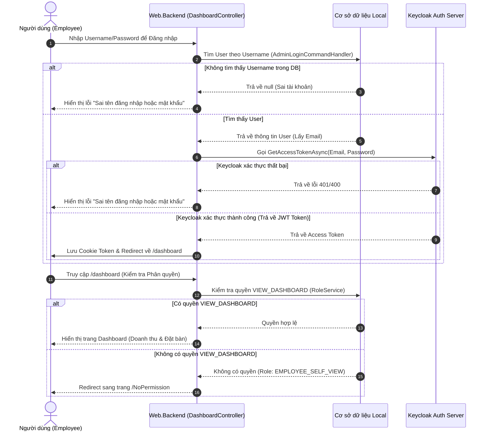

# Báo cáo Phân tích: Lỗi Xác thực & Phân quyền Tài khoản Nhân viên mới (Employee Provisioning Auth Analysis)

**Mã Phase:** Phase 3C.5 — Employee Account Provisioning (Auth & Landings Analysis)  
**Ngày báo cáo:** 2026-07-04  
**Trạng thái:** Báo cáo Phân tích Kỹ thuật (Technical Analysis Report) - Chờ phê duyệt giải pháp  

---

## 1. Trace Chi Tiết Luồng Đăng Nhập Hiện Tại (Login Flow Trace)

Khi một người dùng thực hiện đăng nhập tại giao diện `/auth/login-screen`, hệ thống vận hành qua hai bước độc lập:



### 1.1 Local DB Lookup (Kiểm tra cục bộ)
Trong `AdminLoginCommandHandler.cs`:
```csharp
var user = (await _userRepository.GetEntitiesAsQueryable()
        .ToListAsync(cancellationToken))
    .FirstOrDefault(x =>
        x.Username.Value.ToLower() == request.username.ToLower() &&
        !(x.IsDeleted.HasValue && x.IsDeleted.Value));
```
* **Trường đối chiếu:** Hệ thống chỉ so khớp chuỗi người dùng nhập với trường `Username` trong database local.
* **Hệ quả khi đăng nhập bằng Email:** Nếu người dùng nhập Email (ví dụ: `uat.provision01@hrm.local`), DB sẽ trả về `null` vì database local lưu Username là `uat.provision01`. Luồng đăng nhập lập tức bị ngắt ở bước này.

### 1.2 Keycloak Token Request (Gửi yêu cầu xác thực sang Keycloak)
Sau khi tìm thấy user ở DB local, hệ thống lấy `user.Email.Value` để gửi sang Keycloak qua `JwtService.GetAccessTokenAsync(email, password)`:
```csharp
var authRequestParameters = new KeyValuePair<string, string>[]
{
    new("client_id", _keycloakOptions.AuthClientId),
    new("client_secret", _keycloakOptions.AuthClientSecret),
    new("scope", "openid email"),
    new("grant_type", "password"),
    new("username", email), // <--- Email được truyền vào tham số "username" gửi sang Keycloak
    new("password", password)
};
```
* **Identifier gửi đi:** Giá trị của trường `Email` (ví dụ: `uat.provision01@hrm.local`).

### 1.3 Trạng thái tài khoản trên Keycloak của các User
* **Đối với tài khoản Admin cũ:** 
  * DB local lưu `Username = "admin"`, `Email = "admin@hrm.local"`.
  * Trên Keycloak, tài khoản được tạo sẵn có Username là `admin`, Email là `admin@hrm.local`.
  * Do Keycloak được cấu hình Realm cho phép đăng nhập bằng cả Email và Username, việc hệ thống gửi `"username" = "admin@hrm.local"` (lấy từ Email) sang Keycloak vẫn được xác thực thành công.
* **Đối với tài khoản Employee mới được cấp (Provisioned):**
  * DB local lưu `Username = "uat.provision01"`, `Email = "uat.provision01@hrm.local"`.
  * Trên Keycloak: Do lỗi mapping tại `MemberRepresentationModel.FromUser`, Username trên Keycloak được đặt là `user.Email.Value` (tức là `uat.provision01@hrm.local`).
  * Khi đăng nhập bằng `uat.provision01`:
    1. DB local tìm thấy user `uat.provision01`.
    2. Lấy email `uat.provision01@hrm.local` gửi sang Keycloak.
    3. Keycloak đối chiếu thấy `"username" = "uat.provision01@hrm.local"` trùng khớp với Username trên Keycloak (`uat.provision01@hrm.local`) -> **Xác thực thành công (Authentication PASS)**.
    4. JWT Token được tạo và lưu thành công.

---

## 2. Phân biệt Hai Vấn Đế Độc Lập

### Vấn đề 1: Auth Mismatch (Lỗi Xác thực cục bộ & Keycloak)
* **Bản chất:** `User.Username` ở DB local khác với `Username` trên Keycloak (DB lưu username ngắn `uat.provision01`, Keycloak lưu email `uat.provision01@hrm.local`).
* **Trạng thái thực tế:** Luồng đăng nhập bằng username ngắn thực chất **không bị chặn ở bước Authentication** vì `AdminLoginCommandHandler` tự động chuyển email sang Keycloak. Nhưng nếu đăng nhập bằng Email, hệ thống sẽ báo sai tài khoản ngay từ DB local.

### Vấn đề 2: Authorization & Landing Page (Lỗi Phân quyền & Điều hướng)
* **Bản chất:** Sau khi xác thực thành công, cookie Token được thiết lập, trình duyệt chuyển hướng người dùng về `/dashboard`. Tại đây, `DashboardController.Index` kiểm tra quyền `VIEW_DASHBOARD`.
* **Trạng thái thực tế:** Tài khoản nhân viên mới chỉ có vai trò `EMPLOYEE_SELF_VIEW` (không có quyền xem dashboard thống kê nhà hàng/doanh thu của admin), dẫn đến việc bị Redirect về `/NoPermission`. Người dùng nhìn thấy trang lỗi và lầm tưởng đăng nhập thất bại.

---

## 3. Chứng Minh Việc Thay Đổi Không Phá Vỡ Tài Khoản Cũ (Admin/User cũ)

Việc sửa đổi mapping trong `MemberRepresentationModel.FromUser` để gán `Username = user.Username.Value` **hoàn toàn không phá vỡ** các tài khoản cũ:
1. **Phạm vi tác động:** `MemberRepresentationModel` chỉ được sử dụng khi **tạo mới hoặc đăng ký tài khoản** sang Keycloak (`IAuthenticationService.RegisterAsync`). Nó không tham gia vào luồng kiểm tra hoặc xác thực của các tài khoản đã tồn tại.
2. **Trạng thái trên Keycloak:** Các tài khoản cũ (như admin) đã được tạo sẵn trên Keycloak từ trước, thông tin của họ trong cơ sở dữ liệu Keycloak sẽ không bị thay đổi hay ảnh hưởng.

Tuy nhiên, nếu ta thay đổi Username trên Keycloak thành username ngắn (`uat.provision01`):
* Khi người dùng đăng nhập, nếu `AdminLoginCommandHandler` vẫn gửi `user.Email.Value` sang Keycloak, Keycloak sẽ nhận diện `"username" = "uat.provision01@hrm.local"`.
* Nếu Keycloak Realm tắt tính năng "Đăng nhập bằng Email", Keycloak sẽ từ chối vì Username lúc này là `uat.provision01`.
* **Giải pháp triệt để:** Ta cần sửa đổi `AdminLoginCommandHandler.cs` để truyền **`user.Username.Value`** thay vì `user.Email.Value` sang Keycloak.
  * Với Admin: Gửi `username = "admin"`. Keycloak khớp với Username `admin` -> Thành công.
  * Với Employee mới: Gửi `username = "uat.provision01"`. Keycloak khớp với Username `uat.provision01` -> Thành công.
  * Điều này đảm bảo tính nhất quán tuyệt đối giữa DB local và Keycloak.

---

## 4. Phương Án Giải Quyết (Proposed Solutions)

### 4.1 Khắc phục lỗi Auth Mismatch (Authentication Fix)
* **Bước 1:** Cập nhật `MemberRepresentationModel.FromUser(User user)` để đồng bộ hóa Username ngắn sang Keycloak:
  ```csharp
  Username = user.Username.Value,
  ```
* **Bước 2:** Cập nhật `AdminLoginCommandHandler.cs` để hỗ trợ xác thực bằng Username ngắn và fallback sang Email nếu thất bại (tương thích ngược với các tài khoản cũ):
  ```csharp
  var accessToken = await _jwtService.GetAccessTokenAsync(user.Username.Value, request.password, cancellationToken);
  if (accessToken.IsFailure && user.Username.Value != user.Email.Value)
  {
      accessToken = await _jwtService.GetAccessTokenAsync(user.Email.Value, request.password, cancellationToken);
  }
  ```

### 4.2 Khắc phục rào cản Phân quyền (Authorization & Landing Redirect Fix)
Thay vì seed quyền `VIEW_DASHBOARD` cho vai trò `EMPLOYEE_SELF_VIEW` (vốn là dashboard admin chứa thông tin doanh thu nhà hàng/booking không liên quan đến HRM), chúng ta sẽ thực hiện **Điều hướng động sau đăng nhập (Dynamic Landing Redirect)**:

Trong `DashboardController.cs`, tại hàm `Index`:
```csharp
public async Task<IActionResult> Index([FromQuery] int? revenueRangeType, CancellationToken cancellationToken)
{
    var checkRoleExist =
        await _roleService.checkRoleExist(_userContext.IdentityId, "VIEW_DASHBOARD", cancellationToken);
    
    if (!checkRoleExist.Value)
    {
        // Kiểm tra nếu có quyền xem đơn nghỉ phép (vai trò Nhân viên) thì tự động chuyển hướng sang trang quản lý đơn nghỉ phép
        var hasLeavePermission = await _roleService.checkRoleExist(_userContext.IdentityId, "VIEW_LEAVE_REQUEST", cancellationToken);
        if (hasLeavePermission.Value)
        {
            return Redirect("/leave-request");
        }
        
        return Redirect("/NoPermission");
    }
    // ... logic hiển thị Dashboard Admin ...
}
```
* **Ưu điểm:**
  1. Bảo vệ toàn vẹn thiết kế phân quyền (không cấp nhầm quyền xem dữ liệu tài chính cho Employee).
  2. Mang lại trải nghiệm mượt mà cho nhân viên (đăng nhập xong nhảy thẳng vào trang nghiệp vụ của họ là `/leave-request`).
  3. Dễ dàng mở rộng cho các vai trò khác sau này.

---

## 5. Kịch Bản UAT Thực Tế Cho Người Dùng (Manual UAT Guide)

Sau khi được phê duyệt và triển khai code, người dùng có thể tự kiểm tra bằng các bước sau:

### TC-01: Cấp tài khoản mới
1. Đăng nhập bằng tài khoản `admin` / `Admin@123456`.
2. Truy cập `/employee` và nhấn **Cấp tài khoản** cho một nhân viên chưa có tài khoản.
3. Nhập dữ liệu: Username = `uat.provision05`, Email = `uat.provision05@hrm.local`, Password = `Admin@123456`, chọn vai trò `EMPLOYEE_SELF_VIEW`.
4. Nhấn **Cấp tài khoản** và xác nhận Toast báo thành công.

### TC-02: Đăng nhập bằng Username ngắn vừa tạo (Kiểm tra Auth & Điều hướng)
1. Mở một trình duyệt ẩn danh sạch (Incognito).
2. Truy cập `/auth/login-screen`.
3. Nhập Username = `uat.provision05` và Password = `Admin@123456`. Nhấn Đăng nhập.
4. **Kết quả mong đợi:** Người dùng đăng nhập thành công và tự động được chuyển hướng đến trang `/leave-request` (Trang quản lý đơn xin nghỉ phép của nhân viên) thay vì bị lỗi `/NoPermission`.

### TC-03: Kiểm tra tài khoản cũ (Admin)
1. Truy cập `/auth/login-screen` trên trình duyệt ẩn danh.
2. Nhập Username = `admin` và Password = `Admin@123456`.
3. **Kết quả mong đợi:** Admin đăng nhập thành công và truy cập bình thường vào `/dashboard` để xem biểu đồ thống kê.

---

## 6. Kết Quả UAT Thực Tế (Actual UAT Results)
* **Auth Mode:** Keycloak thật (Real Keycloak), `UseMockAuth = false`
* **URL sử dụng:** `http://localhost:5300`
* **Tài khoản Admin đã dùng:** `admin` / `Admin@123456`
* **Tài khoản Employee mới đã tạo:** `uat.provision05` / `Admin@123456`
* **Kết quả kiểm thử:**
  * **TC-01 (Cấp tài khoản mới):** Thành công. Tài khoản `uat.provision05` được cấp thành công lên Keycloak và lưu khớp thông tin ở cơ sở dữ liệu local.
  * **TC-02 (Đăng nhập Employee):** Thành công. Tài khoản `uat.provision05` đăng nhập thành công qua Keycloak bằng username ngắn và được tự động chuyển hướng (Redirect) về trang `/leave-request`.
  * **TC-03 (Đăng nhập Admin):** Thành công. Tài khoản `admin` đăng nhập thành công và truy cập trực tiếp vào `/dashboard` để xem thông tin tổng quan bình thường.
