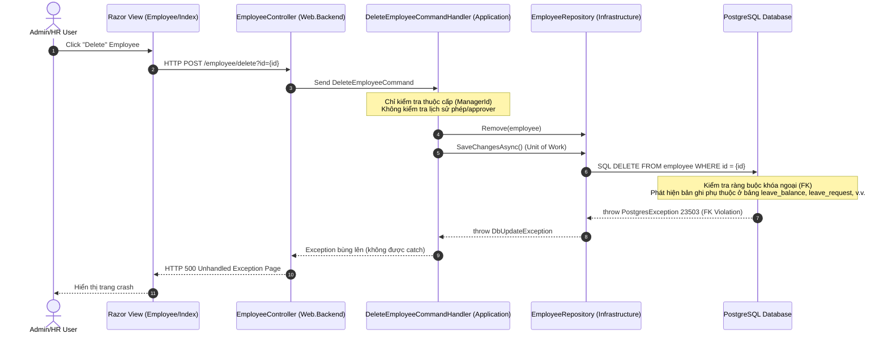

# Báo cáo Phân tích Nguyên nhân Gốc rễ (RCA) — Lỗi Crash Khóa Ngoại khi Xóa Employee

## 1. Triệu chứng lỗi (Symptom)
Khi thực hiện hành động xóa nhân viên (Employee) trên giao diện quản trị HRM, hệ thống ném ra ngoại lệ không được xử lý (unhandled exception) ở tầng cơ sở dữ liệu PostgreSQL với thông báo lỗi vi phạm ràng buộc khóa ngoại (Foreign Key Violation):
`PostgresException: 23503: foreign key violation: fk_leave_balance_employee_employee_id1`

Lỗi này làm crash trang web của người dùng và hiển thị trang lỗi hệ thống (Internal Server Error 500), không đưa ra phản hồi nghiệp vụ thân thiện hay hướng dẫn khắc phục cụ thể.

---

## 2. Bản đồ luồng xóa Employee (Delete Employee Flow Map)
Dưới đây là luồng xử lý hiện tại của yêu cầu xóa Employee qua các tầng kiến trúc:



---

## 3. Phân tích nguyên nhân gốc rễ (Root Cause Analysis)

### 3.1. Ràng buộc ở mức Database (Infrastructure / DB Configuration)
Trong cấu hình EF Core Fluent API ở tầng Infrastructure, các bảng nghiệp vụ HRM liên kết với thực thể `Employee` đều định nghĩa ràng buộc khóa ngoại với quy tắc xóa là **Restrict** (`DeleteBehavior.Restrict`). Điều này đồng nghĩa với việc PostgreSQL sẽ chặn mọi nỗ lực xóa dòng cha (`employee`) nếu còn bất kỳ dòng con nào tham chiếu tới nó:

1. **LeaveBalanceConfiguration (`leave_balance`):**
   ```csharp
   builder.HasOne(lr => lr.Employee)
       .WithMany()
       .HasForeignKey(lr => lr.EmployeeId)
       .OnDelete(DeleteBehavior.Restrict); // Gây lỗi fk_leave_balance_employee_employee_id1
   ```
2. **LeaveRequestConfiguration (`leave_request`):**
   ```csharp
   builder.HasOne(lr => lr.Employee)
       .WithMany()
       .HasForeignKey(lr => lr.EmployeeId)
       .OnDelete(DeleteBehavior.Restrict);
   ```
3. **LeaveApproverAssignmentConfiguration (`leave_approver_assignment`):**
   ```csharp
   builder.HasOne(a => a.Approver)
       .WithMany()
       .HasForeignKey(a => a.ApproverEmployeeId)
       .OnDelete(DeleteBehavior.Restrict);
   ```
4. **LeaveRequestRecalculationAuditConfiguration (`leave_request_recalculation_audit`):**
   ```csharp
   builder.HasOne(a => a.Employee)
       .WithMany()
       .HasForeignKey(a => a.EmployeeId)
       .OnDelete(DeleteBehavior.Restrict);
   ```

### 3.2. Thiếu tiền kiểm tra ở tầng Application (Application Handler)
Trong `DeleteEmployeeCommandHandler.cs` (tầng Application), mã nguồn chỉ mới thực hiện tiền kiểm tra (pre-check) sự tồn tại của nhân viên cấp dưới (subordinates) để chặn xóa:
```csharp
// Check if employee has subordinates
var hasSubordinates = await _employeeRepository.IsExistedAsync(
    x => x.ManagerId == employee.Id);
if (hasSubordinates)
    return Result.Failure<BooleanResponse>(EmployeeErrors.HasSubordinates);
```
Tuy nhiên, Handler hoàn toàn bỏ qua việc kiểm tra sự tồn tại của dữ liệu liên quan đến lịch sử HRM của nhân viên đó trong các bảng phụ thuộc trên (`LeaveBalance`, `LeaveRequest`, `LeaveApproverAssignment`).

Hệ quả là, Handler tiến hành gọi lệnh `_employeeRepository.Remove(employee)` và `SaveChangesAsync()`. Lệnh SQL `DELETE` được gửi trực tiếp xuống DB, vi phạm ràng buộc dữ liệu tại Postgres và ném Exception làm hỏng luồng phản hồi.

---

## 4. Thiết kế hành vi nghiệp vụ mong muốn (Desired Business Behavior)
Để đảm bảo tính toàn vẹn dữ liệu và trải nghiệm người dùng chuyên nghiệp:
* **Chặn xóa cứng (Blocking Hard Delete):** Hệ thống PHẢI chặn việc xóa cứng nhân viên nếu họ đã có lịch sử hoạt động HRM (bao gồm: đã được gán số dư phép, đã tạo đơn xin nghỉ phép, hoặc đã được phân công làm người duyệt phép).
* **Không xóa dây chuyền (No Cascade Delete):** Tuyệt đối không tự động xóa dây chuyền các bản ghi lịch sử xin nghỉ phép hoặc số dư phép của nhân viên để tránh làm sai lệch dữ liệu báo cáo kế toán/nhân sự quá khứ.
* **Thông điệp lỗi nghiệp vụ rõ ràng:** Thay vì crash hệ thống, Handler phải trả về lỗi nghiệp vụ dạng `Result.Failure(Error)` để Controller hiển thị thông báo lỗi thân thiện trên giao diện cho người quản trị (ví dụ: *"Không thể xóa nhân viên do đã có lịch sử nghỉ phép hoặc phân công duyệt phép"*).

---

## 5. Giải pháp kỹ thuật đề xuất (Technical Solution Design)

### Bước 5.1: Bổ dung mã lỗi Domain trong `EmployeeErrors.cs`
Thêm các định nghĩa lỗi nghiệp vụ mới tại tầng Domain để mô tả chính xác lý do chặn xóa:
```csharp
public static Error HasHrmHistory = new(
    "Employee.HasHrmHistory",
    "Không thể xóa nhân viên do có lịch sử số dư phép, đơn nghỉ phép hoặc phân công duyệt phép.");
```
*Hoặc chi tiết hơn:*
```csharp
public static Error HasLeaveBalances = new(
    "Employee.HasLeaveBalances",
    "Không thể xóa nhân viên đã được gán số dư phép.");

public static Error HasLeaveRequests = new(
    "Employee.HasLeaveRequests",
    "Không thể xóa nhân viên đã có đơn nghỉ phép tồn tại.");

public static Error HasApproverAssignments = new(
    "Employee.HasApproverAssignments",
    "Không thể xóa nhân viên đang được phân công duyệt phép.");
```

### Bước 5.2: Nâng cấp `DeleteEmployeeCommandHandler` tại tầng Application
Inject thêm các repository liên quan để thực hiện kiểm tra trước khi xóa:

1. **Khai báo và Inject các Repository phụ thuộc:**
   - `ILeaveBalanceRepository`
   - `ILeaveRequestRepository`
   - `ILeaveApproverAssignmentRepository`

2. **Cập nhật Logic xử lý trong Handler:**
   ```csharp
   // 1. Kiểm tra nhân viên cấp dưới (đã có)
   var hasSubordinates = await _employeeRepository.IsExistedAsync(
       x => x.ManagerId == employee.Id, cancellationToken);
   if (hasSubordinates)
       return Result.Failure<BooleanResponse>(EmployeeErrors.HasSubordinates);

   // 2. Kiểm tra số dư phép (Leave Balance)
   var hasBalances = await _leaveBalanceRepository.IsExistedAsync(
       x => x.EmployeeId == employee.Id, cancellationToken);
   if (hasBalances)
       return Result.Failure<BooleanResponse>(EmployeeErrors.HasLeaveBalances);

   // 3. Kiểm tra đơn nghỉ phép (Leave Request)
   var hasRequests = await _leaveRequestRepository.IsExistedAsync(
       x => x.EmployeeId == employee.Id, cancellationToken);
   if (hasRequests)
       return Result.Failure<BooleanResponse>(EmployeeErrors.HasLeaveRequests);

   // 4. Kiểm tra phân công duyệt phép (Leave Approver Assignment)
   var hasApproverAssignments = await _leaveApproverAssignmentRepository.IsExistedAsync(
       x => x.ApproverEmployeeId == employee.Id, cancellationToken);
   if (hasApproverAssignments)
       return Result.Failure<BooleanResponse>(EmployeeErrors.HasApproverAssignments);
   ```

### Bước 5.3: Cập nhật Controller và UI để xử lý thông điệp lỗi nghiệp vụ
- Tầng **Controller** đã có sẵn cơ chế bắt `result.IsFailure` và trả về `BadRequest(result.Error)`.
- Tầng **UI** (Razor View / Javascript) cần bắt phản hồi lỗi từ API xóa và hiển thị dưới dạng Toast Notification hoặc Alert Banner thay vì để mặc định chuyển hướng khi thất bại.
